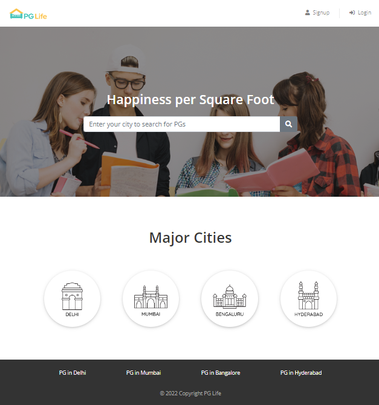

# PGlife

Platform for renter to showcase their properties and students to browse and search for PGs in the city of choice.

###### Made with

### todo:

- [x] Header/footer
- [x] landing page
- [x] Dashboard page
- [x] property page
- [x] property list page
- [x] login/signup modal
- [x] Database Connection
- [x] Signup/SignIn with Sessions
- [x] Toggle_interested
- [ ] Deploy

**Note: Couldn't deploy due to database**
